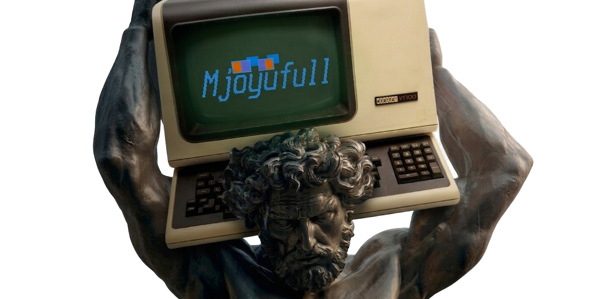

<i>(dynamic development)</i>

  

 
    I build whats needed

---

### Yo!

 I'm **Rikona**.

a open-source developer with a deep passion for safe langs and practical tooling.

####  Projects

Mostly Linux desktop stuff, terminal-heavy workflows, package manager ideas, and experiments I wanted badly enough to build.

**Stuff I keep building on**

- [Elda](https://github.com/Mjoyufull/Elda) - A git-based systems package manager based on [pkgit](github.com/dacctal/pkgit).
- [Kaleidux](https://github.com/Mjoyufull/Kaleidux) - A dynamic wallpaper daemon for Linux with Wayland and X11 support.
- [fsel](https://github.com/Mjoyufull/fsel) - A fast TUI app launcher and fuzzy finder for GNU/Linux and *BSD forked from [gyr](https://git.sr.ht/~nkeor/gyr).
- [Rivet](https://github.com/Mjoyufull/Rivet) - A desktop Matrix client built with GPUI.
- [bfetch](https://github.com/Mjoyufull/bfetch) - A lightweight, ultra-optimized system fetch tool written in C and Austral[bfetchaust](https://github.com/Mjoyufull/bfetch/tree/main/bfetchaust/).
- [Setrixtui](https://github.com/Mjoyufull/Setrixtui) - A Tetris sand game in Ratatui.

**Smaller tools and side quests**

- [pmux](https://github.com/Mjoyufull/pmux) - The pm TUI package browser with Bedrock linux support.
- [PROJECT_STANDARDS](https://github.com/Mjoyufull/PROJECT_STANDARDS) - Project standards and git workflow i follow and subscribe to fully detailed across different languages.
- [goto](https://github.com/Mjoyufull/goto), [fend](https://github.com/Mjoyufull/fend), [swwws](https://github.com/Mjoyufull/swwws), [MNGR](https://github.com/Mjoyufull/MNGR),.

**Configs and desktop theming**

- [Hyprland-Unrounded](https://github.com/Mjoyufull/Hyprland-Unrounded) - My sharper Hyprland setup.
- [Hyprland-rounded-nord](https://github.com/Mjoyufull/Hyprland-rounded-nord) - A rounded Nord-flavored Hyprland setup.
- [old-hyprland-with-waybar-nord](https://github.com/Mjoyufull/old-hyprland-with-waybar-nord) - An earlier Hyprland and Waybar Nord setup.
- [SwayFX-nord](https://github.com/Mjoyufull/SwayFX-nord) - A Nord-themed SwayFX setup.
